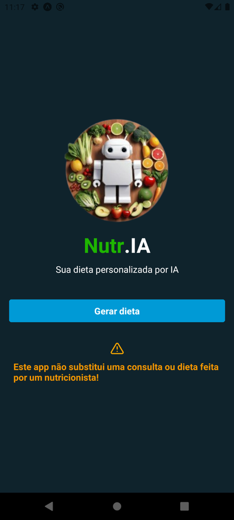

# Nutr.IA 🥦🤖

**Nutr.IA** é uma aplicação que utiliza Inteligência Artificial para oferecer recomendações nutricionais personalizadas com base no perfil e nos objetivos de cada usuário. O objetivo do projeto é facilitar a adoção de hábitos alimentares mais saudáveis de forma prática e inteligente.

## 🚀 Funcionalidades

- ✅ Cadastro de perfil nutricional.
- ✅ Recomendação automática de alimentos saudáveis.
- ✅ Interface intuitiva e responsiva.
- ✅ Integração com serviços de IA.
- ✅ Histórico de recomendações.

## 🛠️ Tecnologias utilizadas

- **Frontend:** ReactJS
- **Backend:** Node.js + Express
- **IA:** Gemini

## 🎥 Demonstração

Confira o app funcionando no LinkedIn: [Clique aqui para ver o vídeo](https://www.linkedin.com/posts/gabriel-arandaa_nutria-inteligenciaartificial-nutriaexaeto-activity-7243997641397690370-umyB?utm_source=share&utm_medium=member_desktop&rcm=ACoAAEU-BDwBNS4mV5zgEdcaRrm9z7vouNR_Dkw)

